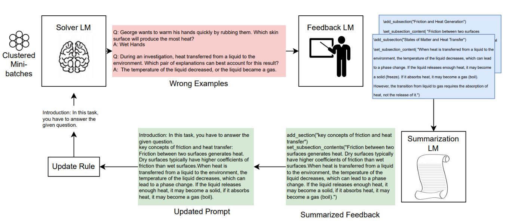

# UniPrompt

<div align="center">



</div>

## About
UniPrompt looks at prompt optimization as that of learning multiple facets of a task from a set of training examples. UniPrompt, consists of a generative model to generate initial candidates for each prompt section; and a feedback mechanism that aggregates suggested edits from multiple mini-batches into a conceptual description for the section. In particular, it can generate long, complex prompts that baseline algorithms are unable to generate.

## Installation

### 📋 Prerequisites

- Python 3 (>= 3.8)

1. Install the latest version of `pip` and `setuptools`

    ```bash
    python3 -m pip install --upgrade pip setuptools
    ```

1. To setup the package locally, run

    ```bash
    python3 -m pip install .
    ```

### 🔧 Setting up

1. **Set Environment Variables**

   **Papyrus Endpoint**: You need to set the `PAPYRUS_CLIENT_ID`, `PAPYRUS_CLIENT_SECRET`, `PAPYRUS_APP_ID` environment variables before running the code.

   **OpenAI Endpoint**: You need to set the `OPENAI_API_KEY` environment variables before running the code.
   
   ### Example Commands

   For **Windows Command Prompt**:
   ```cmd
   set OPENAI_API_KEY=your_api_key
   ```

   For **Windows PowerShell**:
   ```powershell
   $env:OPENAI_API_KEY = "your_api_key"
   ```

   For **Linux systems (Bash)**:
   ```bash
   export OPENAI_API_KEY = "your_api_key"
   ```

1. **Update the Config File**

   Modify the `config/dataset_name.json` file as per your use case.
   If you are using the papyrus endpoint, ensure that `papyrus` is set to `true`. In the config, ignore the `api_kwargs` section and set `model`, `temperature`, `max_tokens` and `stream` in `model_kwargs`.
   
   If you are using an internal endpoint, make sure to set `api_type` to `azure`, `api_base` to your endpoint URL and `api_version` in your dataset config file. If you are using an OpenAI endpoint, then just set api_type to `oai`.
   
   The configuration includes the following parameters:
   ```json
    "dataset_path": "data/pm_search.jsonl",
    "mini_batch_size": 5,
    "batch_size": 7,
    "iterations": 1,
    "epochs": 5,
    "logging_file_path": "logs/pm.jsonl",
    "epsilon": 0.5,
    "beam_width": 3,
    "group_frequency": 2,
    "papyrus": true,
    "create_sub_prompts": true,
    "num_sub_prompts": 5,
    "cache_path": "cache/pm.db",
    "initial_prompt": "<initial_prompt>",
    "metric_kwargs": {
        "type": "weighted_accuracy",
        "weights": [0.4, 0.6]
    },
    "solver_llm": {
        "model_kwargs": {
            "model": "gpt4turbo",
            "temperature": 0,
            "max_tokens": 512,
            "stream": false
        },
        "api_kwargs": {
            "api_type": "",
            "api_base": "",
            "api_version": ""
        }
    },
    "expert_llm": {
        "model_kwargs": {
            "model": "gpt4turbo",
            "temperature": 0,
            "max_tokens": 512,
            "stream": false  
        },
        "api_kwargs": {
            "api_type": "",
            "api_base": "",
            "api_version": ""
        }
    },
    "grouping_llm": {
        "model_kwargs": {
            "model": "gpt4turbo",
            "temperature": 0,
            "max_tokens": 512,
            "stream": false
        },
        "api_kwargs": {
            "api_type": "",
            "api_base": "",
            "api_version": ""
        }
    }
   ```
   Metric `type` can be one of `['accuracy', 'weighted_accuracy', 'hinge_accuracy']` 
   Example config files can be found at [config/ethos.json](config/ethos.json), [config/gk.json](config/gk.json) and [config/sm.json](config/sm.json).
   Make sure to set `api_kwargs` before using them.

   A brief explanations on the config parameters:
   - `dataset_path`: Path to the dataset file
   - `mini_batch_size`: Number of examples processed in each mini-batch
   - `batch_size`: Number of mini-batches processed before updating the prompt
   - `iterations`: Number of times to iterate over the dataset in each epoch
   - `epochs`: Total number of training epochs
   - `logging_file_path`: Path to save the log file
   - `epsilon`: An exploration parameter with range [0, 1]
   - `beam_width`: Number of top-performing prompts to maintain in the beam search
   - `group_frequency`: Group questions every nth epoch
   - `papyrus`: Boolean flag to indicate if the papyrus endpoint needs to be used
   - `create_sub_prompts`: Boolean flag to enable/disable creation of sub-prompts
   - `num_sub_prompts`: Number of sub-prompts to generate if create_sub_prompts is true
   - `cache_path`: Path to store/retrieve cached results
   - `initial_prompt`: The starting prompt for optimization

1. **Prepare the Dataset**

   The dataset format is very important. Ensure your dataset is a JSONL file with the following format:
   - `split`: (train, test, validation)
   - `question`: Full question that you want to get answered, including any prefix or postfix statements
   - `choices`: If the answer has choices, it should be a list, like `[monkey, zebra, lion, tiger]`
   - `answer`: The answer from the options

   Example:
   ```jsonl
   {"split": "train", "question": "What is the largest land animal?", "choices": ["monkey", "zebra", "lion", "tiger"], "answer": "tiger"}
   ```

### 🚀 Running the Optimization

To get the final optimized prompt, you need to run the `optimize` function from the library:

```python
from uniprompt import UniPrompt

with open(config_file, "r") as f:
      config = json.load(f)

optimizer = UniPrompt(config=config)
final_prompt = optimizer.optimize()
```

For a working example, run
```bash
python examples/main.py --config=config/gk.json
```
Or
```bash
pip install datasets
python examples/ethos.py --config=config/ethos.json
```

You can also try out the QK(SM) and PM task by running
```bash
python examples/main.py --config=config/sm.json
```

```bash
python examples/main.py --config=config/pm.json
```

## Contributing

### 🛠️ Setup

```bash
pip install -e "./[dev]"
```

### 🖌️ Style guide

To ensure your code follows the style guidelines, install `ruff ~= 4.0`

```shell
ruff check --fix
```